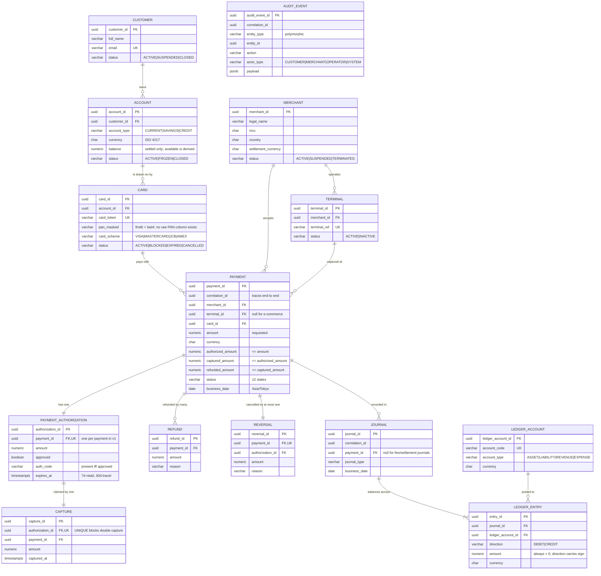

# Entity Relationship Diagram

Schema as created by `payment-core/src/main/resources/db/migration/V1`–`V5`.

`AUDIT_EVENT` is deliberately unlinked: it references entities polymorphically
by `(entity_type, entity_id)` so one stream covers payments, refunds,
settlements and admin actions.

## Design notes

**Why `authorization` and `capture` are separate tables rather than columns on
`payment`.** `payment` holds the *current* state; these hold what actually
happened, with their own timestamps and issuer responses. When Phase 4 adds
ISO 8583 messages, each will map to a row here. The denormalised
`authorized_amount` / `captured_amount` columns on `payment` are a deliberate
read-model convenience, and the CHECK constraints keep them honest.

**Why `capture.authorization_id` is UNIQUE.** It makes double capture
structurally impossible. Even if the idempotency layer is bypassed, or two
capture requests race, the second insert fails on the unique index rather than
double-charging the cardholder.

**Why `account` stores no available balance.** `available = balance − Σ(active
holds)` is derived at read time. Storing it would create a second source of
truth that drifts from the first — see `business-requirements.md` section 4.

**Why there is no raw PAN column.** Not "encrypted", not "restricted" — absent.
`card_pan_is_masked` rejects anything that isn't `first6 + mask + last4`.
